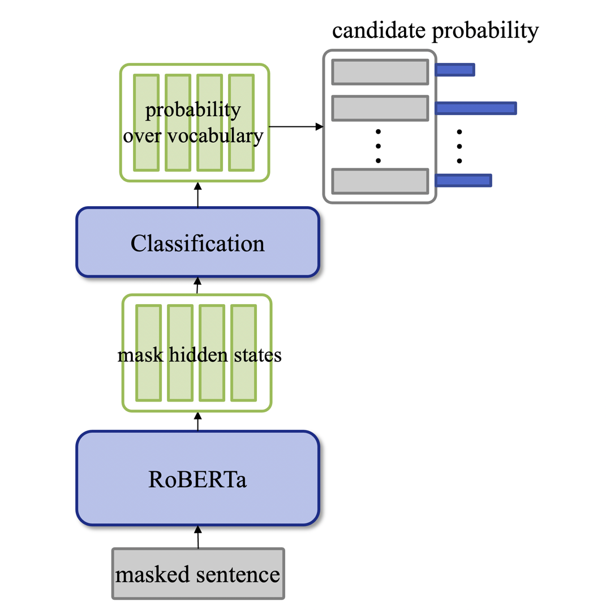
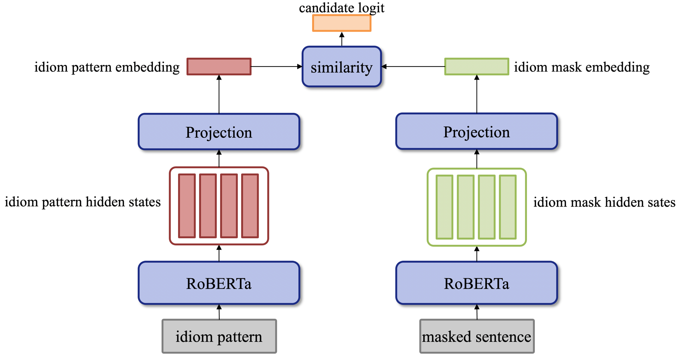
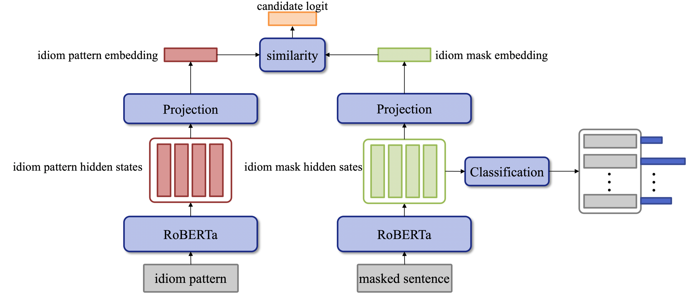
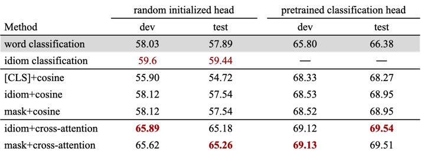

# CL-Bert

计算语言学作业

本项目baseline方法及数据集划分来自项目[ChID_Baseline](https://github.com/Zce1112zslx/ChID_baseline)

## 数据集
项目原始数据集[ChID](https://github.com/chujiezheng/ChID-Dataset),并引入外部成语词典数据[chinese-xinhua](https://github.com/pwxcoo/chinese-xinhua/blob/master/data/idiom.json)
整理后词典数据集文件[data](https://disk.pku.edu.cn:443/link/950B5EA958E7DF572FCD3CE05CD80E05)（下载后放到根目录下）

项目数据[下载链接](https://disk.pku.edu.cn:443/link/EA423797D6BC5E8CBC322F17B7DC3471)(有效期限：2024-12-31 23:59)
，需下载并解压至项目文件夹下

### 数据处理
- [x] 将数据集中待填成语数量大于1的数据都替换为多条数据
- [ ] 同义词等增广方式

### 数据使用
数据使用分为两种方式
- [x] 成语分类：
  - 将数据集中3848条成语编号为成语词表
  - 每条数据包含：
    - `senetence_token`
    - `sentence_mask`
    - `idiom_mask`
    - `idiom_candidate_index`
    - `label`

- [x] 成语释义： 
  - 将所有的成语与对应释义进行拼接,成为`idiom + '：' + explanation`的形式
  - 每条数据包含：
    - `senetence_token`
    - `sentence_mask`
    - `idiom_mask`
    - `idiom_candidate_pattern_token`
    - `idiom_candidate_pattern_mask`
    - `label`
  
## 模型
本项目基于在中文语料上预训练的[RoBERTa模型](https://github.com/ymcui/Chinese-BERT-wwm)进行设计，根据数据的使用方式不同，模型分为两类：**分类模型**与**对比模型**
### 分类模型
- [x] model/baseline.py、model/ClassifyBert.py
  - 输入：`senetence_token`、`sentence_mask`、`idiom_mask`、`idiom_candidate_index`、[`label`]
  - 输出：`predict`
  - 损失函数：`CrossEntropyLoss`
  - 评价指标：`Accuracy`

  
### 对比模型
- [x] model/DualBert.py、model/ContrastiveBert.py
  - 输入：`senetence_token`、`sentence_mask`、`idiom_mask`、`idiom_candidate_pattern_token`、`idiom_candidate_pattern_mask`、[`label`]
  - 输出：`predict`
  - 损失函数：`InfoNCELoss`
  - 评价指标：`Accuracy`

### 结合模型
综合模型将两类任务在同一个模型中进行学习。

## 训练
### random initialized head
#### word classification
``
python train.py --model_type baseline --batch_size 24  --task_type IE --epoch 10 --warm_up_proportion 0.05 
``
#### idiom classification
``  
python train.py --model_type classify --batch_size 24  --task_type IC --epoch 10 --warm_up_proportion 0.05 
``
#### idiom + cosine
``
python train.py --model_type dual --batch_size 24  --task_type IE --sim_mode cosine_similarity  --epoch 10 --warm_up_proportion 0.05
``
#### [CLS] + cosine
``
python train.py --model_type dual --batch_size 24  --task_type IE --sim_mode cosine_similarity --idiom_use_cls --epoch 10 --warm_up_proportion 0.05
``
#### mask + cosine
``
python train.py --model_type dual --batch_size 24  --task_type IE --sim_mode cosine_similarity --idiom_use_mask --epoch 10 --warm_up_proportion 0.05
``
#### idiom + cross-attention
``
python train.py --model_type dual --batch_size 24  --task_type IE --sim_mode cross_attention --epoch 10 --warm_up_proportion 0.05
`` 
#### mask + cross-attention
``
python train.py --model_type dual --batch_size 24  --task_type IE --sim_mode cross_attention --idiom_use_mask --epoch 10 --warm_up_proportion 0.05
``

### pre-trained classification head
#### word classification
``
python train.py --model_type baseline --batch_size 24 --task_type IE --epoch 10 --warm_up_proportion 0.05 --use_pretrained_generation
``
#### idiom + cosine
``
python train.py --model_type dual --batch_size 24 --task_type IE --sim_mode cosine_similarity  --epoch 10 --warm_up_proportion 0.05 --use_pretrained_generation
``
#### [CLS] + cosine
``
python train.py --model_type dual --batch_size 24 --task_type IE --sim_mode cosine_similarity --idiom_use_cls --epoch 10 --warm_up_proportion 0.05 --use_pretrained_generation
``
#### mask + cosine
``
python train.py --model_type dual --batch_size 24 --task_type IE --sim_mode cosine_similarity --idiom_use_mask --epoch 10 --warm_up_proportion 0.05 --use_pretrained_generation
``
#### idiom + cross-attention
``
python train.py --model_type dual --batch_size 24 --task_type IE --sim_mode cross_attention --epoch 10 --warm_up_proportion 0.05 --use_pretrained_generation
``
#### mask + cross-attention
``
python train.py --model_type dual --batch_size 24 --task_type IE --sim_mode cross_attention --idiom_use_mask --epoch 10 --warm_up_proportion 0.05 --use_pretrained_generation
``

## 实验结果

